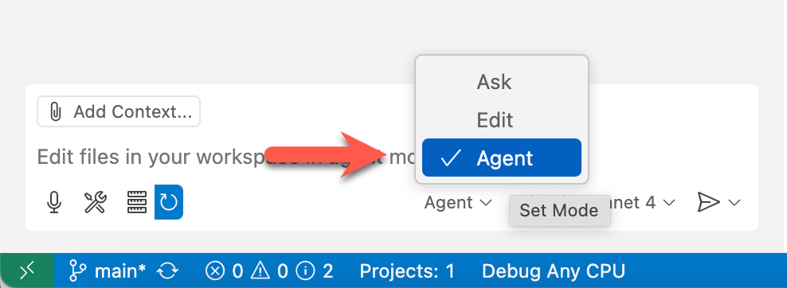

# 00: 개발 환경 설정

이 단계에서는 워크숍을 위한 개발 환경을 설정합니다.

## 전제 조건

준비 사항에 대해서는 [README](../README.md) 문서를 참고하세요.

## 시작하기

- [Visual Studio Code 사용하기](#visual-studio-code-사용하기)
- [PowerShell 설치 👉 Windows 사용자용](#powershell-설치--windows-사용자용)
- [git CLI 설치](#git-cli-설치)
- [GitHub CLI 설치](#github-cli-설치)
- [Docker Desktop 설치](#docker-desktop-설치)
- [Visual Studio Code 설치](#visual-studio-code-설치)
- [Visual Studio Code 시작하기](#visual-studio-code-시작하기)
- [MCP 서버 설정하기](#mcp-서버-설정하기)
- [GitHub Copilot Agent 모드 확인하기](#github-copilot-agent-모드-확인하기)
- [Beast 모드 설정하기](#beast-모드-설정하기)
- [사용자 지정 지침 준비하기](#사용자-지정-지침-준비하기)

## Visual Studio Code 사용하기

### PowerShell 설치 👉 Windows 사용자용

1. PowerShell이 이미 설치되어 있는지 확인하세요.

    ```bash
    # Bash/Zsh
    which pwsh
    ```

    ```bash
    # PowerShell
    Get-Command pwsh
    ```

   `pwsh`의 명령어 경로가 보이지 않으면, PowerShell이 아직 설치되지 않았다는 의미입니다. [PowerShell 설치 페이지](https://learn.microsoft.com/powershell/scripting/install/installing-powershell)를 방문하여 지침을 따르세요.

1. PowerShell 버전을 확인하세요.

    ```bash
    pwsh --version
    ```

   `7.5.0` 이상을 권장합니다. 버전이 그보다 낮다면, [PowerShell 설치 페이지](https://learn.microsoft.com/powershell/scripting/install/installing-powershell)를 방문하여 지침을 따르세요.

### git CLI 설치

1. git CLI가 이미 설치되어 있는지 확인하세요.

    ```bash
    # Bash/Zsh
    which git
    ```

    ```bash
    # PowerShell
    Get-Command git
    ```

   `git`의 명령어 경로가 보이지 않으면, git CLI가 아직 설치되지 않았다는 의미입니다. [git CLI 설치 페이지](https://git-scm.com/downloads)를 방문하여 지침을 따르세요.

1. git CLI 버전을 확인하세요.

    ```bash
    git --version
    ```

   `2.39.0` 이상을 권장합니다. 버전이 그보다 낮다면, [git CLI 설치 페이지](https://git-scm.com/downloads)를 방문하여 지침을 따르세요.

### GitHub CLI 설치

1. GitHub CLI가 이미 설치되어 있는지 확인하세요.

    ```bash
    # Bash/Zsh
    which gh
    ```

    ```bash
    # PowerShell
    Get-Command gh
    ```

   `gh`의 명령어 경로가 보이지 않으면, GitHub CLI가 아직 설치되지 않았다는 의미입니다. [GitHub CLI 설치 페이지](https://cli.github.com/)를 방문하여 지침을 따르세요.

1. GitHub CLI 버전을 확인하세요.

    ```bash
    gh --version
    ```

   `2.65.0` 이상을 권장합니다. 버전이 그보다 낮다면, [GitHub CLI 설치 페이지](https://cli.github.com/)를 방문하여 지침을 따르세요.

1. GitHub에 로그인되어 있는지 확인하세요.

    ```bash
    gh auth status
    ```

   아직 로그인하지 않았다면, `gh auth login`을 실행하여 로그인하세요.

### Docker Desktop 설치

1. Docker Desktop이 이미 설치되어 있는지 확인하세요.

    ```bash
    # Bash/Zsh
    which docker
    ```

    ```bash
    # PowerShell
    Get-Command docker
    ```

   `docker`의 명령어 경로가 보이지 않으면, Docker Desktop이 아직 설치되지 않았다는 의미입니다. [Docker Desktop 설치 페이지](https://docs.docker.com/get-started/introduction/get-docker-desktop/)를 방문하여 지침을 따르세요.

1. Docker CLI 버전을 확인하세요.

    ```bash
    docker --version
    ```

   `28.0.4` 이상을 권장합니다. 버전이 그보다 낮다면, [Docker Desktop 설치 페이지](https://docs.docker.com/get-started/introduction/get-docker-desktop/)를 방문하여 지침을 따르세요.

### Visual Studio Code 설치

1. VS Code가 이미 설치되어 있는지 확인하세요.

    ```bash
    # Bash/Zsh
    which code
    ```

    ```bash
    # PowerShell
    Get-Command code
    ```

   `code`의 명령어 경로가 보이지 않으면, VS Code가 아직 설치되지 않았다는 의미입니다. [Visual Studio Code 설치 페이지](https://code.visualstudio.com/)를 방문하여 지침을 따르세요.

1. VS Code 버전을 확인하세요.

    ```bash
    code --version
    ```

   `1.99.0` 이상을 권장합니다. 버전이 그보다 낮다면, [Visual Studio Code 설치 페이지](https://code.visualstudio.com/)를 방문하여 지침을 따르세요.

   > **참고**: `code` 명령을 실행할 수 없을 수도 있습니다. 이 경우 설정을 위해 [이 문서](https://code.visualstudio.com/docs/setup/mac#_launching-from-the-command-line)를 따르세요.

### Visual Studio Code 시작하기

1. 작업 디렉터리를 생성하세요.
1. 이 저장소를 포크하고 로컬 머신에 클론합니다.

    ```bash
    gh repo fork 2c234f60-dce0-4fd6-b89b-055e867fde02/docker-handson-demo --clone
    ```

1. 클론된 디렉터리로 이동하세요.

    ```bash
    cd docker-handson-demo
    ```

1. 터미널에서 VS Code를 실행하세요.

    ```bash
    code .
    ```

1. VS Code 내에서 새 터미널을 열고 다음 명령을 실행하여 저장소 상태를 확인하세요.

    ```bash
    git remote -v
    ```

   다음과 같이 표시되어야 합니다. `origin`에 `2c234f60-dce0-4fd6-b89b-055e867fde02`가 보이면, 포크된 저장소에서 다시 클론해야 합니다.

    ```bash
    origin  https://github.com/<your GitHub ID>/docker-handson-demo (fetch)
    origin  https://github.com/<your GitHub ID>/docker-handson-demo (push)
    upstream        https://github.com/2c234f60-dce0-4fd6-b89b-055e867fde02/docker-handson-demo.git (fetch)
    upstream        https://github.com/2c234f60-dce0-4fd6-b89b-055e867fde02/docker-handson-demo.git (push)
    ```

1. 다음 확장 프로그램이 설치되어 있는지 확인하세요 — [GitHub Copilot](https://marketplace.visualstudio.com/items?itemName=GitHub.copilot)과 [GitHub Copilot Chat](https://marketplace.visualstudio.com/items?itemName=GitHub.copilot-chat).

    ```bash
    # Bash/Zsh
    code --list-extensions | grep github.copilot
    ```

    ```powershell
    # PowerShell
    code --list-extensions | Select-String "github.copilot"
    ```

   아무것도 보이지 않으면, 해당 확장 프로그램이 아직 설치되지 않았다는 의미입니다. 다음 명령을 실행하여 확장 프로그램을 설치하세요.

    ```bash
    code --install-extension "github.copilot" --force && code --install-extension "github.copilot-chat" --force
    ```

### MCP 서버 설정하기

1. 로컬 머신에서 VS Code를 사용한다면 Docker Desktop이 실행 중인지 확인하세요.
1. `$REPOSITORY_ROOT` 환경 변수를 설정하세요.

   ```bash
   # bash/zsh
   REPOSITORY_ROOT=$(git rev-parse --show-toplevel)
   ```

   ```powershell
   # PowerShell
   $REPOSITORY_ROOT = git rev-parse --show-toplevel
   ```

1. MCP 서버 설정을 복사하세요.

    ```bash
    # bash/zsh
    cp -r $REPOSITORY_ROOT/docs/.vscode/. \
          $REPOSITORY_ROOT/.vscode/
    ```

    ```powershell
    # PowerShell
    Copy-Item -Path $REPOSITORY_ROOT/docs/.vscode/* `
              -Destination $REPOSITORY_ROOT/.vscode/ -Recurse -Force
    ```

1. F1 키를 누르거나 Windows에서는 `Ctrl`+`Shift`+`P`, Mac OS에서는 `Cmd`+`Shift`+`P`를 눌러 명령 팔레트를 열고, `MCP: List Servers`를 검색하세요.
1. `context7`을 선택한 다음 `Start Server`를 클릭하세요.
1. `awesome-copilot`을 선택한 다음 `Start Server`를 클릭하세요.

## GitHub Copilot Agent 모드 확인하기

1. GitHub Codespace 또는 VS Code 상단에 있는 GitHub Copilot 아이콘을 클릭하여 GitHub Copilot 창을 열어주세요.

   

1. 로그인이나 가입을 하라고 나오면 진행하세요. 무료입니다!
1. GitHub Copilot Agent 모드를 사용하고 있는지 확인하세요.

   

1. 모델을 `GPT-4.1` 또는 `Claude Sonnet 4` 중 하나로 선택하세요.

## Beast 모드 설정하기

1. `/mcp.awesome-copilot.get_search_prompt`를 입력한 다음 "beast mode"와 같은 키워드를 입력하세요.

   Beast 챗모드 목록이 표시될 것입니다. `4.1 Beast Chat Mode`와 비슷한 프롬프트를 입력하세요. 그러면 `.github/chatmodes` 디렉터리에 저장됩니다.

1. `Agent` 모드 대신 `4.1-Beast` 모드를 선택하세요. 자동으로 LLM이 `GPT 4.1`로 변경됩니다.

1. `$REPOSITORY_ROOT` 환경 변수를 설정하세요.

   ```bash
   # bash/zsh
   REPOSITORY_ROOT=$(git rev-parse --show-toplevel)
   ```

   ```powershell
   # PowerShell
   $REPOSITORY_ROOT = git rev-parse --show-toplevel
   ```

1. 워크스페이스 설정을 복사하세요.

    ```bash
    # bash/zsh
    cp $REPOSITORY_ROOT/docs/.vscode/settings.json \
       $REPOSITORY_ROOT/.vscode/settings.json
    ```

    ```powershell
    # PowerShell
    Copy-Item -Path $REPOSITORY_ROOT/docs/.vscode/settings.json `
              -Destination $REPOSITORY_ROOT/.vscode/settings.json -Force
    ```

## 사용자 지정 지침 준비하기

1. `$REPOSITORY_ROOT` 환경 변수를 설정하세요.

   ```bash
   # bash/zsh
   REPOSITORY_ROOT=$(git rev-parse --show-toplevel)
   ```

   ```powershell
   # PowerShell
   $REPOSITORY_ROOT = git rev-parse --show-toplevel
   ```

1. 사용자 지정 지침을 복사하세요.

    ```bash
    # bash/zsh
    cp -r $REPOSITORY_ROOT/docs/custom-instructions/setup/. \
          $REPOSITORY_ROOT/.github/
    ```

    ```powershell
    # PowerShell
    Copy-Item -Path $REPOSITORY_ROOT/docs/custom-instructions/setup/* `
              -Destination $REPOSITORY_ROOT/.github/ -Recurse -Force
    ```

---

좋습니다. "개발 환경 설정" 단계를 완료했습니다. 이제 [5단계: 컨테이너화](./05-containerization.md)로 이동하세요.

> 원본 데모에서는 현재 단계에서 요구사항명세를 기준으로 openapi라는 백엔드 설계문서를 만듭니다.\
> 그 다음 Python 백엔드, JS 프론트, 백엔드 Java로 마이그레이션, 프론트 .Net으로 마이그레이션을 수행합니다.\
> 해당 단계는 시간적 제약으로 모두 생략합니다.
